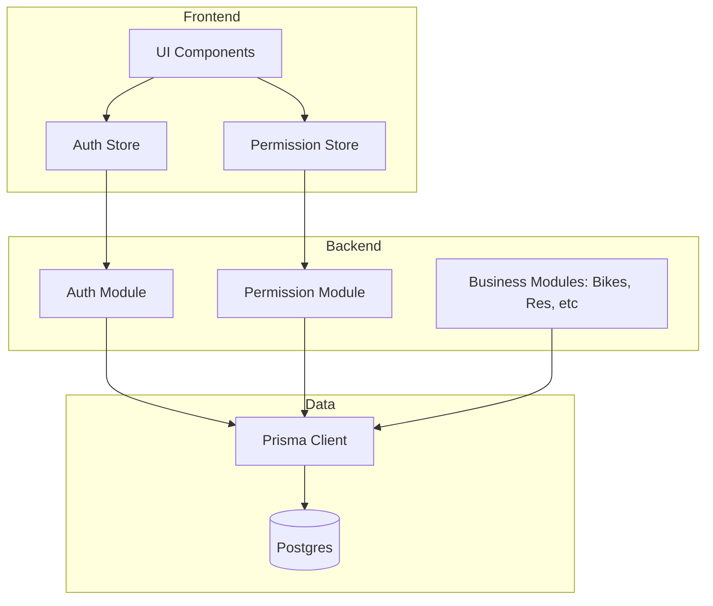

# Integration Map

## Skill Dependencies
| Skill | Responsibility | Orchestrated By |
|-------|----------------|-----------------|
| `skill-master-orchestrator` | Central Logic & Coordination | Root Agent |
| `saas-architecture-designer` | Flow, DB Schema, Core Backend | Master Orchestrator |
| `ui-ux-designed` | Frontend Components & Styling | Master Orchestrator |
| `permissions-engine-pro` | RBAC, Guards, Access Control | Master Orchestrator |
| `maps-visualization-engine` | Google Maps, Routes, Tracking | Master Orchestrator |

## Module Communications

## Critical Sync Points
1. **Login**: `/auth/login` -> AuthStore Update -> PermStore Hydration.
2. **Reservation**: `POST /reservations` -> Check Bike Status -> Create Transaction -> Update Payment.
3. **Tracking**: WebSocket connection -> Shared BikeLocation entity -> Real-time Maps UI.
